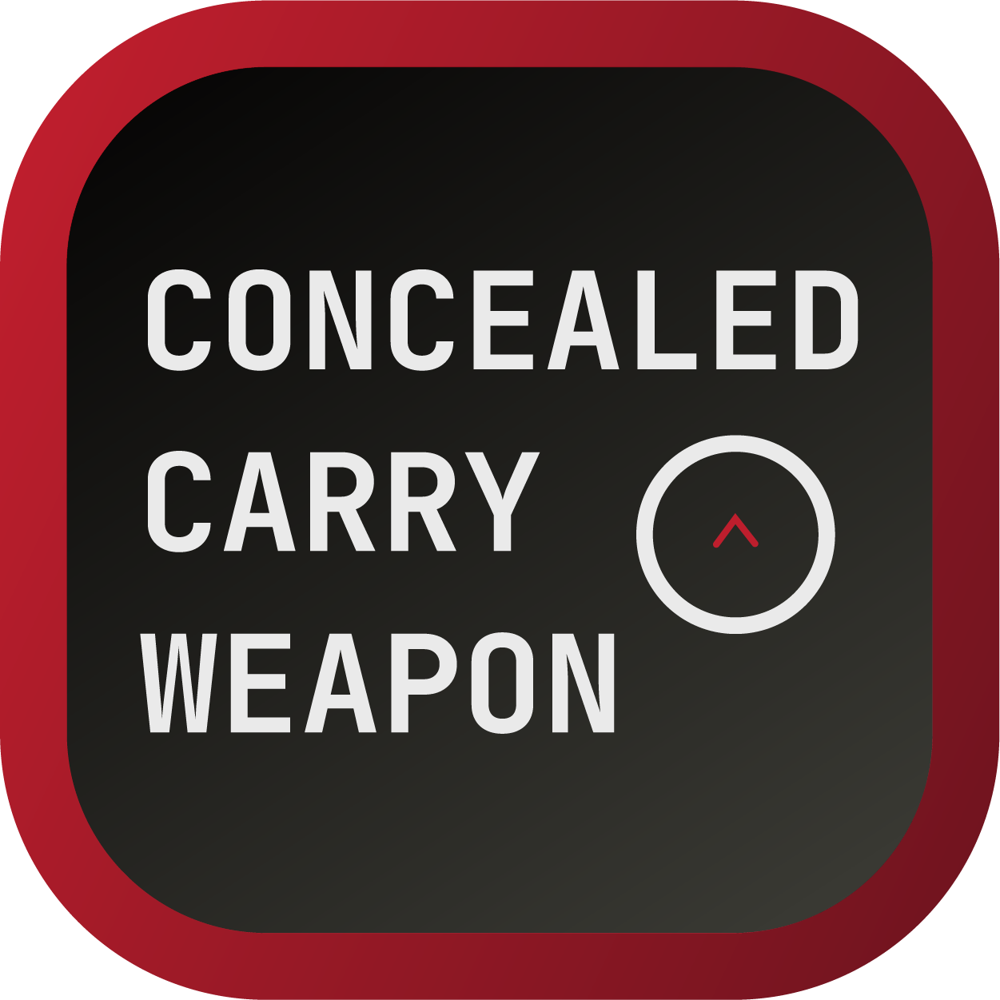
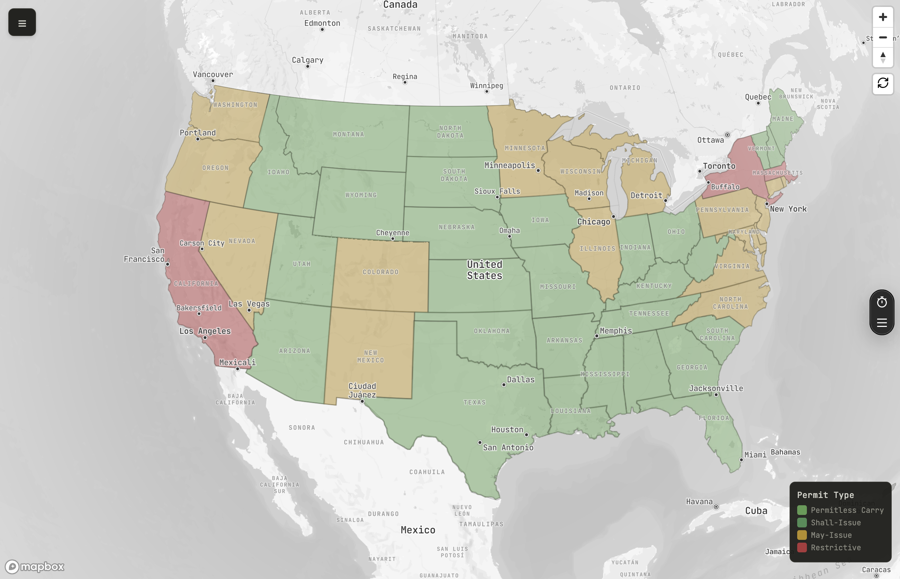
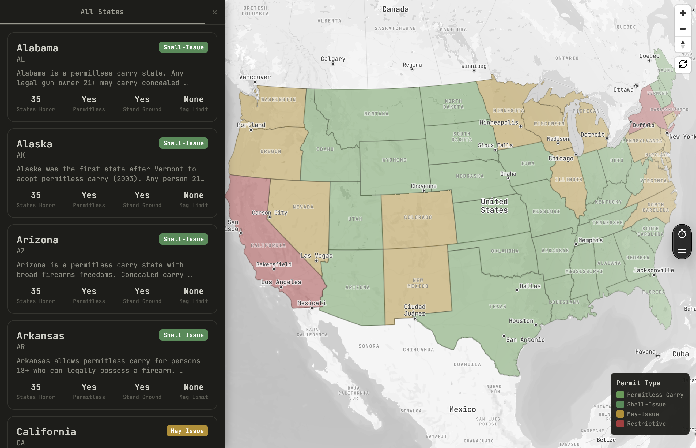
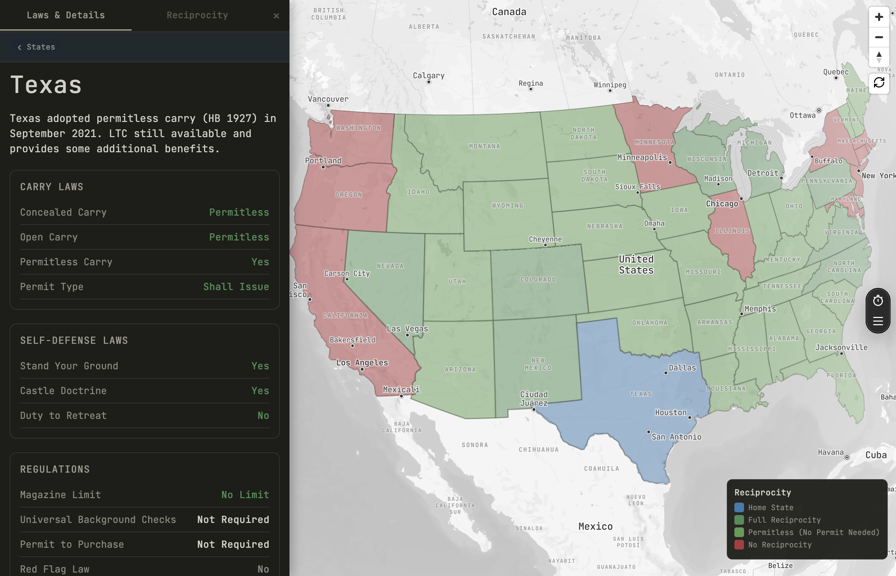
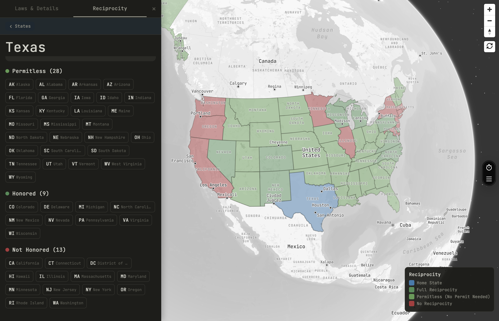

<div align="center">
  

  # CCW Map

  **Know your rights. Know where you can carry.**

  An interactive, mobile-first app tracking concealed carry laws across all 50 US states + DC — with a live reciprocity map, full law breakdowns, and legislative monitoring.

  [](https://ccw-map.vercel.app/)
  [](https://ccw-map.vercel.app/)
  [](https://www.typescriptlang.org/)
  [](LICENSE)

</div>

---

## About

CCW laws vary dramatically by state — what's legal to carry in Texas may be a felony in California. For permit holders who travel, keeping track of where you're covered is genuinely difficult.

CCW Map solves that. Tap a state on the interactive map and instantly see which states honor your permit, what the local carry laws are, and whether anything has changed recently in the legislature. No legal jargon, no wall of text — just the information you need, state by state.

**Built for carriers who travel. Not for lawyers.**

---

## Screenshots

| Map Overview | States List |
|:------------:|:-----------:|
|  |  |

| State Detail | Reciprocity |
|:------------:|:-----------:|
|  |  |

---

## Features

### 🗺️ Interactive Reciprocity Map
Mapbox-powered map with US state boundaries. Tap any state to see which states recognize your home permit — color-coded for instant clarity.

### 📋 Complete Law Database
Per-state breakdowns covering:
- Permit types (shall-issue, may-issue, constitutional/permitless carry)
- Open and concealed carry rules
- Self-defense and castle doctrine laws
- Magazine capacity restrictions
- Prohibited locations and off-limits zones

### 🔄 Reciprocity Matrix
A full state-by-state grid showing exactly where each state's permit is honored across all 50 states + DC.

### 📰 Legislative Tracking
Live LegiScan API integration to monitor new gun-related bills and law changes as they move through state legislatures.

### 📱 Cross-Platform
Runs natively on iOS and Android via React Native, with full web support deployed to Vercel.

---

## Tech Stack

| Layer | Technology |
|-------|------------|
| Framework | React Native + Expo (Expo Router) |
| Maps | Mapbox GL (`@rnmapbox/maps` for native, `mapbox-gl` for web) |
| Language | TypeScript |
| Web Deploy | Vercel |
| Legislation API | LegiScan |

---

## Setup

### Prerequisites

- Node.js 18+
- [Mapbox account](https://account.mapbox.com/) — public + secret token
- [LegiScan API key](https://legiscan.com/legiscan) *(optional — only needed for legislative tracking)*

### Installation

1. **Clone and install:**
   ```bash
   git clone https://github.com/d4vid4nderson/ccw-map.git
   cd ccw-map
   npm install
   ```

2. **Configure API keys:**

   | File | Placeholder | Where to get it |
   |------|-------------|-----------------|
   | `src/constants/mapbox.ts` | `YOUR_MAPBOX_PUBLIC_TOKEN` | Mapbox Dashboard → Tokens |
   | `app.json` | `YOUR_MAPBOX_SECRET_TOKEN` | Mapbox Dashboard → Tokens |
   | `src/services/legiscan.ts` | `YOUR_LEGISCAN_API_KEY` | LegiScan API page |

3. **Run:**

   ```bash
   # Web
   npm run web

   # iOS simulator
   npm run ios

   # Android emulator
   npm run android
   ```

---

## Deploy to Vercel

Connect the GitHub repo to Vercel for automatic deployments on every push, or deploy manually:

```bash
npx vercel
```

The `vercel.json` config is already included — zero additional configuration needed.

---

## Data Sources

| Data | Source |
|------|--------|
| CCW Laws | USCCA, Handgunlaw.us, NRA-ILA, official state statutes |
| Reciprocity | USCCA, USACarry, state attorney general offices |
| State Boundaries | US Census Bureau GeoJSON via PublicaMundi |
| Legislation | LegiScan API |

---

## License

MIT — see [LICENSE](LICENSE) for details.

---

## Disclaimer

> This app is for **informational purposes only**. Gun laws change frequently and vary by jurisdiction. Always verify current laws with official state sources before carrying a firearm. **This is not legal advice.**
